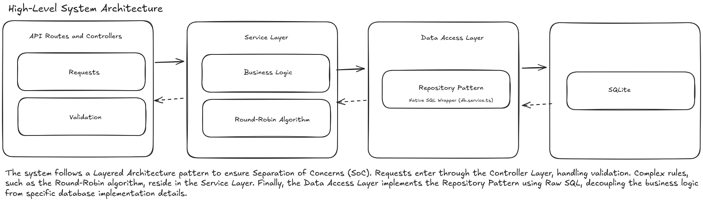
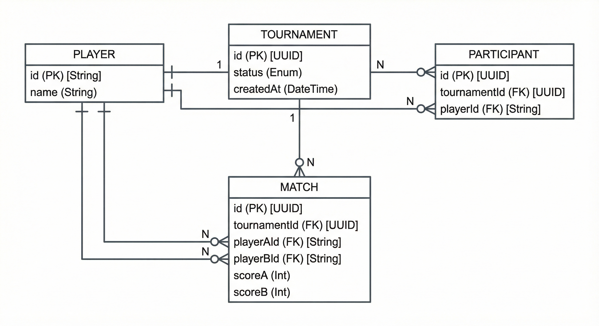

# Round-Robin Tournament Service 🏆

A robust Backend REST API to manage sports tournaments, implementing the **Round-Robin** system where every participant plays against everyone else.

Built with **Node.js**, **Express**, **TypeScript**, and **SQLite**.

---

## Architecture & Design

I implemented a **Layered Architecture** to ensure Separation of Concerns (SoC) and scalability.



### Key Decisions
1.  **Repository Pattern:** Instead of using an ORM like Prisma, I implemented a custom Repository pattern using the provided `db.service.ts`. This demonstrates proficiency with **Raw SQL** and low-level data manipulation.
2.  **Round-Robin Logic:** The pairing algorithm uses a double-loop approach (`O(n^2)`) to generate exactly `N*(N-1)/2` matches, ensuring no duplicates.
3.  **Atomic Transactions:** Match results automatically trigger tournament completion checks.

### Database Schema (ERD)
The database was designed to ensure data integrity with foreign keys and unique constraints.


---
## 🚀 How to Run

### Prerequisites
- Node.js (v18+)
- NPM

### 1. Install Dependencies

```bash
npm install
```

### 2. Initialize Database

This script creates the SQLite file and the necessary tables.

```bash
npm run db:init
```

### 3. Start Server

```bash
npm run dev
```

The API will be available at http://localhost:3000/api.

### How to test

You have two ways to test the application:

**Option A: Automated End-to-End Script (Recommended) 🤖**

I included a script that simulates a full tournament lifecycle (Creation -> Matchmaking -> Scoring -> Leaderboard) in seconds.

```bash
npm run test:e2e
```

Option B: Manual Testing (cURL) 🛠️

If you prefer to test endpoints manually, follow this workflow:

| Step | Action | Endpoint | Method | Body Example |
| :---: | :--- | :--- | :---: | :--- |
| 1 | **Create** | `/api/tournaments` | `POST` | (None) |
| 2 | **Add Player** | `/api/tournaments/:id/participants` | `POST` | `{"name": "Alice"}` |
| 3 | **Start** | `/api/tournaments/:id/start` | `PATCH` | (None) |
| 4 | **Result** | `/api/matches/:matchId/result` | `POST` | `{"scoreA": 2, "scoreB": 1}` |
| 5 | **Ranking** | `/api/tournaments/:id/leaderboard` | `GET` | (None) |

Quick Copy-Paste Example:

```bash
# 1. Create Tournament
curl -X POST http://localhost:3000/api/tournaments

# 2. Add Players (Replace :id with the UUID from step 1)
curl -X POST http://localhost:3000/api/tournaments/:id/participants -H "Content-Type: application/json" -d '{"name":"Alice"}'
curl -X POST http://localhost:3000/api/tournaments/:id/participants -H "Content-Type: application/json" -d '{"name":"Bob"}'

# 3. Start
curl -X PATCH http://localhost:3000/api/tournaments/:id/start

# 4. Check Leaderboard
curl http://localhost:3000/api/tournaments/:id/leaderboard
```

### Documentation

- [API Documentation](docs/API.md): Detailed list of all endpoints, parameters, and example responses.

- [AI Usage Report](AI_USAGE.md): A transparency report detailing how AI tools were used to assist development.

- [Challenge Instructions](README.md): The original requirements for this project.

